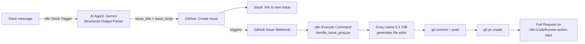

# n8n-CodeRunner

**An autonomous AI coding agent pipeline** — describe a bug or feature in plain English on Slack (or as a GitHub issue), and a self-hosted n8n workflow turns it into a real, reviewable pull request without anyone touching a terminal.

> Inspired by NeuralNine's Claude Code + n8n tutorial, rebuilt with **Gemini** for structured output parsing and **Groq (Llama 3.3 70B)** for the actual code generation step.

---

## How it works



There are two n8n workflows that hand off to each other:

1. **Slack → GitHub Issue.** Someone posts a request in a Slack channel. An n8n AI Agent node, backed by **Gemini**, is forced into structured output (a strict `{issue_title, issue_body}` schema) so the message is rewritten into a clean, ticket-ready issue — no extra commentary, no hallucinated scope. n8n then opens the issue via the GitHub API and posts the link back to Slack.
2. **GitHub Issue → Pull Request.** Creating that issue fires a GitHub webhook back into n8n, which runs a local Python script via the **Execute Command** node. The script clones/pulls the target repo, cuts an isolated branch, calls an LLM to generate the actual code change, commits, force-pushes the branch, and opens the PR with the GitHub CLI (`gh`).

The repo that actually receives the generated commits and PRs lives separately at [`n8n-CodeRunner-action-repo`](https://github.com/debanshughosh009/n8n-CodeRunner-action-repo) — this repo is the orchestration/automation layer, not the codebase being patched.

---

## Tech stack

| Layer | Tool |
|---|---|
| Orchestration | [n8n](https://n8n.io) (self-hosted, not cloud — needs local shell access) |
| Public webhook tunnel | [ngrok](https://ngrok.com) |
| Slack → Issue parsing | Google **Gemini** API, structured JSON output |
| Issue → Code generation | **Groq** API (`llama-3.3-70b-versatile`), structured output via Pydantic schema |
| Git automation | GitHub CLI (`gh`) + native `git` over HTTPS/SSH |
| Source control trigger | GitHub Issue webhooks |

---

## Repo structure

```
n8n-CodeRunner/
├── scripts/
│   ├── handle_issue_groq.py     # active engine — Groq Llama 3.3 70B generates the patch
│   ├── handle_issue_gemini.py   # alternate engine — Gemini generates the patch
│   └── handle_issue_claude.py   # original engine — headless Claude Code CLI generates the patch
├── n8n_setup.md                 # env vars for launching self-hosted n8n
├── ngrok_setup.md                # tunnel command for exposing n8n locally
└── .gitignore                    # keeps API keys / tokens out of git
```

Three interchangeable "engines" live side by side in `scripts/`, all triggered the same way from n8n's Execute Command node — swap which script the node calls to switch how code gets generated:

- **`handle_issue_groq.py`** *(current default)* — reads the existing codebase as context, sends it plus the issue to Groq's `llama-3.3-70b-versatile` model with a strict `{"changes": [{"filepath", "content"}]}` JSON schema (enforced via Pydantic + `response_format={"type": "json_object"}`), then writes each returned file straight to disk.
- **`handle_issue_gemini.py`** — same flow, but generation goes through `google-genai`'s native `response_schema` support instead of Groq.
- **`handle_issue_claude.py`** — the original approach from the tutorial this project was inspired by: shells out to the `claude` CLI in headless mode (`-p ... --permission-mode acceptEdits`) and lets Claude Code edit the working directory directly instead of returning structured JSON.

All three scripts follow the same lifecycle: clone-or-pull → branch (`{engine}/issue-{number}`) → generate → `git add . && git commit` → force-push → `gh pr create --base main --head {branch}`.

---

## Setup

### 1. Self-host n8n 

```bash
WEBHOOK_URL="<your-ngrok-subdomain>" \
N8N_EDITOR_BASE_URL="<your-ngrok-subdomain>" \
N8N_ENABLE_UNSAFE_CORE_NODES=true \
NODES_EXCLUDE='[]' \
N8N_RUNNERS_ENABLED=true \
N8N_PROXY_HOPS=1 \
GENERIC_TIMEZONE="Asia/Kolkata" \
TZ="Asia/Kolkata" \
n8n
```

### 2. Expose it publicly with ngrok

```bash
ngrok http 5678
```

Use the generated `https://*.ngrok-free.app` URL as both `WEBHOOK_URL` above and the callback URL registered with Slack/GitHub.

### 3. Credentials & secrets

None of these are committed — they're gitignored on purpose:

| File | Purpose |
|---|---|
| `api_keys/gemini_api_key.md` | Gemini API key |
| `api_keys/groq_api_key.md` | Groq API key |
| `github_token.md` | Fine-grained GitHub PAT with `Issues`, `Pull Requests`, `Contents`, `Webhooks` write access |

### 4. Wire up n8n

- **GitHub Issue Trigger** node → authenticate with the PAT above, scope it to your target repo (the action-repo), listen for the `issues` event.
- **Execute Command** node → call the engine of choice, e.g.:
  ```bash
  python3 scripts/handle_issue_groq.py "{{$json.repository.full_name | base64}}" "{{$json.issue.number | base64}}" "{{$json.issue.title | base64}}" "{{$json.issue.body | base64}}"
  ```
- **Slack Trigger** node → listen on `message.channels` for your automation channel.
- **AI Agent (Gemini) node** → system prompt: *"Turn the following Slack message into a GitHub issue with a title and body. Keep it concise. Don't add anything that wasn't asked for."* Output format locked to the `{issue_title, issue_body}` schema.
- **GitHub Create Issue** node → feeds off the structured Gemini output.

---

## Why this exists

Small, low-risk feature requests and copy/UI tweaks from non-technical teammates shouldn't need a developer's full attention just to get typed up and pushed. This pipeline lets anyone describe what they want in Slack; the AI does the actual diffing and committing, and a human only has to review and merge the resulting PR.

## Disclaimer

This is a personal learning/automation project, not a production CI/CD system. The Execute Command node runs with full local shell access and force-pushes branches — keep it pointed at a sandbox repo (see [`n8n-CodeRunner-action-repo`](https://github.com/debanshughosh009/n8n-CodeRunner-action-repo)) rather than anything you care about.
